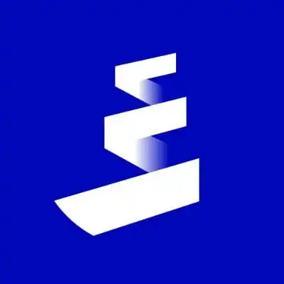

<div align="center">



# 🐙 OctoBot — The AI Knowledge & Experience Layer for Pharos

### Your AI companion for the Pharos ecosystem

Documentation • Live Data • Voice • Multilingual • Web Experience


## Public Link
https://pharos-octobot-by-echo.streamlit.app/

*(If unavailable, the request quota may have expired. You can clone the repo and run locally with your own API key.)*

[](https://pharos.xyz)
[](https://dorahacks.io/hackathon/pharos-phase1)
[](https://fastapi.tiangolo.com)
[](https://langchain.com)
[](https://streamlit.io)

</div>

---

# ✨ What is OctoBot?

OctoBot is a Pharos-native AI Skill built for Pharos Network. It started as a Pharos Knowledge Skill and has grown into a complete on-chain AI companion — the first reusable intelligence layer built natively for the Pharos AI Agent ecosystem.

Rather than behaving like a traditional documentation chatbot, OctoBot combines four production-ready Skills into a single callable API that any Agent on Pharos can use:

* Pharos Knowledge Skill — RAG-powered answers from verified Pharos documentation, zero hallucination, source-cited

* Live Market Skill — real-time $PROS price and market data from CoinGecko, cached and fallback-safe

* Wallet Intelligence Skill — reads any Pharos wallet via public RPC, synthesises an AI-generated on-chain profile, zero gas, no signature

* Transaction Explainer Skill — reads any Pharos transaction hash on-chain and returns a plain-language explanation via Gemini

Any Agent deployed on Pharos can call all four Skills through a single API endpoint and receive structured, source-aware, on-chain-verified responses. OctoBot's architecture is built on a RAG pipeline using ChromaDB for vector retrieval and Gemini 2.5 Flash for generative responses, with FastAPI exposing every capability as a composable, reusable Skill module. **

---

# 🚀 Why OctoBot?

Every Agent built on Pharos will eventually need to answer user questions about the protocol — what are SPNs, how does restaking work, what is RWA, how do I build here, what does this transaction mean. Traditionally, each Agent would have to build its own documentation retrieval, its own RPC integration, and its own AI pipeline — duplicated effort, inconsistent quality, and wasted build time.

OctoBot solves this at the infrastructure level. It is a plug-and-play Skill suite that any Pharos Agent can call instead of rebuilding from scratch:

* No RAG pipeline to build

* No RPC integration to write

* No documentation to crawl

* No price API to maintain

This is the core promise of the Pharos Skill model — reusable, composable modules that let Agents focus on unique business logic while OctoBot handles knowledge retrieval, on-chain reading, and AI synthesis..**


## What problem does this solve?

The Pharos AI Agent economy needs a shared knowledge and on-chain intelligence layer. Without it, every Agent reinvents the same wheel. OctoBot is that layer — built once, callable by all.

Concretely, OctoBot enables:

* Any Agent to answer "What is Pharos?" without building a RAG system
* Any Agent to profile a user's wallet without writing RPC code
* Any Agent to explain a transaction without integrating Gemini directly
* Any user to explore Pharos, understand their on-chain activity, track $PROS, and get a personalised build path for dApps, Agents, infrastructure, or learning — all from within the same interface
* 
The long-term vision is for OctoBot to become an embedded intelligence layer across the entire Pharos ecosystem — the one Skill every Agent calls first.

---

## 🔮 Onchain Features {WIP on Site (Available on Skill API)}

### OctoBot Memory Ledger — On-Chain User Intelligence
> *A Pharos-native AI companion that knows you before you speak.*

The next evolution of OctoBot moves beyond a documentation chatbot into a true on-chain intelligent companion. By reading a connected wallet's Pharos transaction history, staking positions, SPN interactions, RWA holdings, and campaign participation, OctoBot will synthesise a private intelligence profile and make every interaction deeply personalised.

#### How it works

| Step | Action |
|------|--------|
| 🔗 Wallet Connect | User connects Pharos wallet — OctoBot reads last 90 days of on-chain activity |
| 🧠 Intelligence Synthesis | Gemini processes on-chain data to infer builder type, risk profile, and intent |
| 💬 Contextual Answers | Every RAG response becomes personalised to your actual positions and history |
| 🔔 Proactive Alerts | OctoBot surfaces campaign deadlines, LP range warnings, and new SPN opportunities |
| 💾 Memory Persistence | Profile signed by wallet and persisted — OctoBot remembers context across sessions |

#### What it feels like

Instead of:
> *"Here's how Native Restaking works."*

OctoBot says:
> *"You have 2,400 PROS staked since March. Adding to the SPN-2 pool would increase your yield by ~12% at current rates. Want me to walk you through the steps?"*

#### Why it matters
- First AI agent to derive **identity and intent from on-chain behaviour** rather than user-filled forms
- Uniquely powerful on Pharos due to high signal density — SPNs, RWA positions, and campaign data all on one chain
- Transforms OctoBot from a chatbot into a **trusted Pharos-native advisor**

  


#### Technical stack
- Pharos EVM-compatible RPC for transaction history
- Gemini 2.5 Flash for profile synthesis
- MetaMask / WalletConnect for wallet auth
- Signed message anchored in Pharos calldata for on-chain profile persistence

---

## Premium · x402

OctoBot includes a **Premium · x402** mode that enables pay-per-call AI responses using native on-chain payments.

### How it Works

1. **Enable Premium Mode**

   * A **"Pay-per-call answers"** toggle is available in the chat sidebar.
   * It is **disabled by default**, so all existing free chat functionality remains unchanged.
   * When enabled, your next prompt becomes a **Premium x402** request.

2. **HTTP 402 Payment Challenge**

   * Instead of generating an answer immediately, OctoBot returns a genuine **HTTP 402 – Payment Required** challenge displaying:

     * Payment amount (**0.05 PROS**)
     * Network
     * Pay-to address
     * Resource ID

3. **Complete the Payment**

   * Scan the generated **EIP-681 QR code** or use the provided `ethereum:` payment URI.
   * Pay directly from your wallet.

4. **Verify On-chain**

   * Paste the transaction hash and click **Verify & Unlock**.
   * OctoBot verifies the payment on-chain using `fetch_pharos_transaction`, ensuring:

     * The transaction succeeded
     * The payment was sent to the correct address
     * The required amount was paid (with a small tolerance for gas/rounding)

   This is **real on-chain settlement verification**, not a simulated payment flow.

5. **Unlock Premium Response**

   * After successful verification, OctoBot:

     * Generates a richer, more structured premium response powered by Gemini and grounded in your documentation.
     * Displays an **⚡ Premium · x402 Settled** badge.
     * Logs an **x402 payment receipt** in the chat sidebar.


## Transaction simulation/explainer

A User pastes a Pharos transaction hash, OctoBot fetches it via eth_getTransactionReceipt (read-only, same safety profile as Memory Ledger) and explains in plain language what happened


## Payment Requests (on-chain invoicing)

"Request 10 PROS from 0x1234… for design work"

* → generates a shareable link
* → recipient opens link, sees the invoice, clicks pay
* → one click, wallet signs, done

No other Pharos tool lets you send a payment request. This alone would get used daily by every builder in the ecosystem.


# NEW FEATURE WIP :

**OctoBot Autonomous Payment Agent — AI-to-AI PROS Payments on Pharos**

An AI agent that sends and receives PROS on Pharos using simple natural language commands, without any wallet interaction.

**What it does:**
Users give plain English instructions like:

* "Send 5 PROS to 0x1234…" 
* "Send 1 PROS each to 0xAAA…, 0xBBB…, 0xCCC…" 
* "Approve 0xFaroswap to spend 100 PROS"
  


OctoBot then:

* Interprets intent using Gemini
* Checks PROS balance via RPC
* Builds transaction calldata
* Shows a human-readable confirmation (amount, gas, total)
* Executes via  Wallet after approval
* Returns on-chain confirmation with tx hash + block info


* For recurring payments, The option is there but would need a backend server to run it :( it stores the schedule in an on-chain scheduler contract on Pharos that any agent can trigger.


# 🖥️ Website Experience (NEW)


OctoBot is no longer just chat.


The app now includes a redesigned website experience while keeping the original Pharos identity.

### Homepage

* Minimal welcome experience
* Cleaner structure
* Better onboarding
* Animated live UI feeling
* Improved hero section

### Added Sections

* 💬 Chat with OctoBot
* 📖 Ecosystem Dapps
* 📢 Campaigns Section
* 📰 Updates Section
* 💹 Trade Pharos Area
* ⚡ Featured Actions
* 📊 Live Token Dashboard

### UI Improvements

* Improved visual hierarchy
* Better spacing and layouts
* Cleaner cards
* Responsive structure
* More polished interactions


## SPN Explorer

What it does: Pharos's biggest unique feature is Special Purpose Networks — essentially customisable sub-networks that run on top of Pharos for specific use cases (DeFi, RWA, AI, gaming etc).

No tool currently shows these in a visual, explorable way. This page would explain what each SPN is, show its status (live/testnet/coming soon), what it's built for, and link to it.

How you'd test it: Open the Ecosystem page equivalent but for SPNs. You'd see cards for each network, click through to learn more, and the AI (OctoBot) can answer questions about any specific SPN.
Limitation: Pharos doesn't have a public SPN API yet so the data would be curated manually from their docs — but it would still be the only visual SPN explorer that exists.

## Validator / Network Dashboard

What it does: A live stats page that hits the Pharos RPC and shows block height, latest block time, transaction count, active validators, network TPS — all updating in real time.

Think of it like a mini block explorer focused on network health rather than individual transactions.

How you'd test it: Navigate to the page and watch the numbers update every 10 seconds. You can verify the block height is real by cross-checking it against pharosscan.xyz.  

---

# 🧠 AI Features

## Documentation Intelligence

Ask questions directly from verified Pharos sources and LLM Models.

## Model Fallback

If information isn't available in documentation, OctoBot intelligently responds instead of failing. 


## Multilingual + Read answers Support

Ask in your own language.

Chat input placeholder updates too  when Hindi is selected it shows "Ask OctoBot in Hindi 🌐" so users know the language is active.
English stays clean when English is selected, no prefix is added and the fallback prompt uses standard English instructions, so there's zero overhead for the default case.

Examples:

```text
Hindi → PROS ka price kya hai
Spanish → ¿Qué son las SPNs?
Japanese → Pharosとは何ですか？
Arabic → ما هو فاروس؟
```

Replies preserve technical terms while adapting language naturally.

---
## Build Path Generator 


It:
First tries the RAG pipeline with a relevant question about that goal
Feeds the RAG context (if found) into a Gemini prompt asking for structured JSON: goal label, 4-5 numbered steps (title + description), 2-3 doc links, 2-3 action links
Returns the parsed dict or falls back to the RAG text answer


# 📈 Live Ecosystem Data

## PROS Token Integration

Powered via CoinGecko.

Features:

* Live Price
* Market Cap
* Volume
* Auto refresh (5 min)
* Dedicated API endpoint
* Table visualization in Streamlit
* Token responses directly inside chat

 

<!-- ===================================================== -->

<!--                    HOW TO TEST                        -->

<!-- ===================================================== -->
# 🧪 How to Test

OctoBot can be tested through multiple interfaces depending on whether you want to validate the Skill API directly, test structured responses, or experience the full UI.

---

## ① Interactive Swagger UI *(Fastest — No Code Needed)*

Use Swagger to test all 6 Skill endpoints directly in your browser.

### Start the Skill API
```bash
uvicorn skill_api:app --host 0.0.0.0 --port 8000
```

### Open Swagger UI
```text
http://localhost:8000/docs
```

---

### Execute a Query

Navigate to:
```http
POST /query
```

Click:
```text
Try it out → Execute
```

Paste:
```json
{
  "question": "What are Special Processing Networks?"
}
```

Expected behavior:
✅ Structured RAG response from verified Pharos docs  
✅ Live $PROS price appended for token-related questions  
✅ Source-aware output with citations  

---

## ② Call the Skill from Terminal

Direct API access for developers and Agent integrations.

### 2a — Ask a Pharos Question

```bash
curl -X POST http://localhost:8000/query \
  -H "Content-Type: application/json" \
  -d "{\"question\": \"What is Native Restaking on Pharos?\"}"
```

Response:
```json
{
  "answer": "Native Restaking on Pharos allows validators to...",
  "sources": [
    {
      "url": "https://docs.pharos.xyz/restaking",
      "title": "Native Restaking — Pharos Docs"
    }
  ],
  "found_in_docs": true,
  "pros_price": null
}
```

---

### 2b — Get Live $PROS Price

```bash
curl http://localhost:8000/pros-price
```

Response:
```json
{
  "price_usd": 0.5828,
  "market_cap_usd": 75000000,
  "volume_24h": 4200000,
  "change_24h": 7.39,
  "last_updated": "2025-06-15 14:32 UTC",
  "available": true,
  "source": "CoinGecko",
  "asset_id": "pharos-network"
}
```

---

### 2c — Wallet Intelligence Profile

```bash
curl -X POST http://localhost:8000/wallet-profile \
  -H "Content-Type: application/json" \
  -d "{\"address\": \"0xYourWalletAddressHere\"}"
```

Response:
```json
{
  "address": "0xYour...",
  "balance_pros": 12.4832,
  "tx_count": 47,
  "is_contract": false,
  "profile": {
    "summary": "This wallet is an active Pharos explorer with 47 transactions and a healthy PROS balance. Activity patterns suggest a DeFi-native user comfortable with on-chain interactions.",
    "tags": ["Active Trader", "Pharos Native", "On-chain Verified"],
    "risk": "Moderate",
    "insight": "Consider exploring Faroswap for yield opportunities on your PROS holdings."
  },
  "available": true,
  "explorer_url": "https://pharosscan.xyz/address/0xYour..."
}
```

---

### 2d — Transaction Explainer

```bash
curl -X POST http://localhost:8000/explain-tx \
  -H "Content-Type: application/json" \
  -d "{\"tx_hash\": \"0xYourTxHashHere66CharactersLong\"}"
```

Response:
```json
{
  "tx_hash": "0xYour...",
  "from_addr": "0xabc...",
  "to_addr": "0xdef...",
  "value_pros": 5.0,
  "gas_used": 21000,
  "gas_price_gwei": 1.0,
  "status": "success",
  "block_number": 123456,
  "is_contract_call": false,
  "explanation": {
    "summary": "This was a simple PROS transfer that completed successfully. The sender moved 5 PROS to another wallet with minimal gas cost.",
    "category": "Transfer",
    "plain_steps": [
      "Sent from 0xabc...",
      "Received by 0xdef...",
      "Status: completed successfully"
    ]
  },
  "available": true,
  "explorer_url": "https://pharosscan.xyz/tx/0xYour..."
}
```

---

## ③ Use the Chat UI *(Recommended Experience)*

Launch the complete OctoBot web experience.

### Start Streamlit
```bash
streamlit run app.py
```

Open:
```text
http://localhost:8501
```

### Included Experience

| Feature | Included |
|---|---|
| Animated Hero Section | ✅ |
| Nothing OS Memory Ledger Page | ✅ |
| On-chain Wallet Profiler | ✅ |
| Transaction Explainer | ✅ |
| Live $PROS Price + Chart | ✅ |
| RAG Chat with Source Citations | ✅ |
| Multilingual Support (50+ Languages) | ✅ |
| Active Campaigns Directory | ✅ |
| Pharos Ecosystem DApp Browser | ✅ |
| CEX Trading Links | ✅ |
| Sidebar Example Prompts | ✅ |
| Conversation Memory | ✅ |
| Follow-up Question Generation | ✅ |
| Voice Reply | ✅ |
| Responsive Layout | ✅ |

---

## ④ Test the Health Check

Verify the Skill is online and check live status.

### Request
```http
GET http://localhost:8000/
```

### Response
```json
{
  "skill": "pharos-knowledge",
  "version": "2.0.0",
  "status": "online",
  "knowledge_chunks": 350,
  "model": "gemini",
  "pros_price_usd": 0.5828,
  "coingecko_status": "ok"
}
```

---

## ⑤ Discover Skill Metadata

Retrieve the full Skill spec for Agent discovery and integration.

### Request
```http
GET http://localhost:8000/info
```

### Returns
```text
✓ All 4 Skill endpoint descriptions
✓ Input / Output schema for each
✓ Live data providers and cache settings
✓ Safety guarantees (read-only, zero gas, no signature)
✓ Tags and categories for Agent discovery
```

Useful for future Agent orchestration and reusable integrations.

---

<br>

# 🔌 Skill API Reference

<div align="center">

| Method | Endpoint | Description |
|:---:|:---:|---|
| GET | `/` | Health check — status, knowledge size, live price |
| POST | `/query` | RAG answer from Pharos docs + optional live $PROS price |
| GET | `/pros-price` | Live $PROS price and market data from CoinGecko |
| POST | `/wallet-profile` | On-chain wallet intelligence profile via Pharos RPC |
| POST | `/explain-tx` | Plain-language transaction explanation via Pharos RPC |
| GET | `/info` | Full Skill metadata for Agent discovery |
| GET | `/docs` | Interactive Swagger UI — test all endpoints in browser |

</div>

---

# 📨 POST `/query`

### Request Body
```json
{
  "question": "string — any question about Pharos Network"
}
```

### Response Schema
```json
{
  "answer": "string — RAG answer from verified Pharos documentation",
  "sources": [
    {
      "url": "string — source page URL",
      "title": "string — source page title"
    }
  ],
  "found_in_docs": true,
  "pros_price": {
    "price_usd": 0.5828,
    "market_cap_usd": 75000000,
    "change_24h": 7.39,
    "available": true,
    "source": "CoinGecko"
  }
}
```

### Response Fields

| Field | Type | Description |
|---|---|---|
| `answer` | `string` | RAG-generated answer from Pharos documentation |
| `sources` | `array` | Supporting source citations with URL and title |
| `found_in_docs` | `boolean` | Whether answer originated from verified documentation |
| `pros_price` | `object \| null` | Live $PROS market data — only present for token-related questions |

---

# 📨 POST `/wallet-profile`

### Request Body
```json
{
  "address": "0x1234...42-character-Pharos-wallet-address"
}
```

### Response Fields

| Field | Type | Description |
|---|---|---|
| `address` | `string` | The queried wallet address |
| `balance_pros` | `float \| null` | Current PROS balance on Pharos |
| `tx_count` | `int \| null` | Total transaction count |
| `is_contract` | `boolean` | Whether the address is a smart contract |
| `profile` | `object \| null` | AI-generated intelligence profile (summary, tags, risk, insight) |
| `available` | `boolean` | Whether RPC data was successfully fetched |
| `explorer_url` | `string` | Direct link to Pharosscan explorer |

---

# 📨 POST `/explain-tx`

### Request Body
```json
{
  "tx_hash": "0xabc...66-character-transaction-hash"
}
```

### Response Fields

| Field | Type | Description |
|---|---|---|
| `tx_hash` | `string` | The queried transaction hash |
| `from_addr` | `string \| null` | Sender address |
| `to_addr` | `string \| null` | Recipient address |
| `value_pros` | `float \| null` | PROS value transferred |
| `gas_used` | `int \| null` | Gas units consumed |
| `gas_price_gwei` | `float \| null` | Gas price in Gwei |
| `status` | `string \| null` | `success`, `failed`, or `pending` |
| `block_number` | `int \| null` | Block in which tx was included |
| `is_contract_call` | `boolean` | Whether tx called a smart contract |
| `explanation` | `object \| null` | AI-generated plain-language explanation (summary, category, steps) |
| `available` | `boolean` | Whether RPC data was successfully fetched |
| `explorer_url` | `string` | Direct link to Pharosscan explorer |

---

# 🛡 Safety Guarantees

All on-chain endpoints (`/wallet-profile`, `/explain-tx`) are strictly read-only:

| Guarantee | Status |
|---|---|
| No signature required | ✅ |
| Zero gas used | ✅ |
| No funds accessed | ✅ |
| Public blockchain data only | ✅ |
| No wallet connection needed | ✅ |
| Reads from Pharos public RPC | ✅ |

---

# 🤖 Built With

| Component | Technology |
|---|---|
| LLM | Gemini 2.5 Flash (Google) |
| Embeddings | HuggingFace `all-MiniLM-L6-v2` |
| Vector DB | ChromaDB |
| RAG Framework | LangChain |
| Skill API | FastAPI + Uvicorn |
| Web UI | Streamlit |
| Price Data | CoinGecko Free API |
| On-chain Data | Pharos Public RPC |

---

*Built for the AI hackathon*  
*By Echo · Discord: @echoplex99 · [@isharik99](https://x.com/isharik99) on X · [GitHub](https://github.com/isharik/Pharos-Octobot)*


<div align="center">

### ⚓ Built for reusable Agent integration

</div>

```

# 🧩 Ecosystem Hub — Discover the Pharos Ecosystem

As OctoBot evolved beyond a documentation assistant, one challenge became clear:

> Users shouldn't have to leave the platform to discover what is being built on Pharos.

To solve this, OctoBot introduces a dedicated **Ecosystem Hub** — a centralized discovery layer that brings Pharos applications, tools, and ecosystem projects into a single experience.

---

## 🌐 A New Ecosystem Navigation Experience

A new navigation section has been added to the application:

```text
🧩 Ecosystem
```

Designed as a curated gateway into the growing Pharos ecosystem.

Rather than searching through announcements, social posts, or external websites, users can explore ecosystem projects directly from inside OctoBot.

---

## 🚀 Featured Pharos DApps

The Ecosystem Hub currently includes **14 confirmed Pharos ecosystem projects**:

* Faroswap
* Bitverse
* AquaFlux
* Asseto
* AutoStaking
* Brokex
* OpenFi
* Zenith
* Fiamma
* Gotchipus
* Buzzing Club
* PNS
* Spout Finance
* Grandline

---

## ✨ Rich Discovery Experience

Every ecosystem entry includes:

* 🏷️ Project category
* 📝 Short project description
* 🎨 Visual identifier (emoji)
* 🔗 Direct project link

Providing users with quick context before visiting a project.

---

## 🔍 Smart Category Filtering

To improve exploration, the Ecosystem Hub includes **Category Filter Pills** at the top of the page.

Users can instantly filter projects by category and discover relevant applications without scrolling through the entire ecosystem list.

This creates a faster and more organized discovery experience as the ecosystem continues to grow.

---

## 🎯 Why This Matters

The goal isn't simply to list DApps.

The goal is to make OctoBot a gateway into the broader Pharos ecosystem.

By combining documentation, live ecosystem information, and project discovery in a single interface, users can learn, explore, and take action without leaving the platform.

<div align="center">

### ⚓ Discover • Learn • Explore • Build

**Everything Pharos. One Experience.**

</div>


      


    
# 🔍 Knowledge Sources other than LLM responses

OctoBot currently retrieves from verified sources:

| Source            | Coverage               |
| ----------------- | ---------------------- |
| docs.pharos.xyz   | Official Documentation |
| buildonpharos.com | Developer Resources    |
| Pharos GitHub     | Technical References   |
| Medium Articles   | Deep Technical Content |
| Bitget Academy    | Ecosystem Explanations |

More sources continue to be crawled and indexed.

---

# ⚙️ Tech Stack

| Layer      | Technology           |
| ---------- | -------------------- |
| LLM        | Gemini               |
| Embeddings | Google Generative AI |
| Vector DB  | ChromaDB             |
| Framework  | LangChain            |
| Backend    | FastAPI              |
| Frontend   | Streamlit            |
| Crawling   | BeautifulSoup        |
| Language   | Python 3.11+         |

---


# What OctoBot delivers:

✅ Simple input — send a question string

✅ Structured output — returns answer + sources + found_in_docs status

✅ Agent friendly integration — callable through a standard HTTP POST request

✅ Discoverable architecture — exposed through the /info metadata endpoint

✅ Source grounded responses — answers include references for verification

✅ Transparent behavior — clearly indicates when information is unavailable instead of pretending certainty

✅ Built to reduce hallucinations — retrieval first, generation second

✅ Composable by design — can plug into future Agents and workflows that require Pharos knowledge

The goal was not to build another chatbot.
The goal was to create a reusable knowledge layer that any future Pharos Agent can rely on.


# 📌 Recent Updates (Check @isharik on X for more details and walkthroughs on Updates :) )

## FOR MORE UPDATES CHECK OUT THE CODE 

---


# 🛠️ Run Locally

```bash
git clone https://github.com/YOUR_USERNAME/octobot.git

cd octobot

python -m venv venv

# Windows
venv\Scripts\activate

# Mac/Linux
source venv/bin/activate

pip install -r requirements.txt
```

Create `.env`

```env
GOOGLE_API_KEY=your_key_here
```

Run:

```bash
python crawl_docs.py

python build_vectorstore.py

uvicorn skill_api:app --reload

streamlit run app.py
```

---

---

---

# 🎯 Vision

OctoBot is becoming more than a knowledge skill.

The goal is to create the **AI front page of Pharos** where users can explore documentation, discover updates, access live data, and interact with the ecosystem in one place.

---

<div align="center">

Built with 🩵 for the Pharos community

⭐ Star the repo if you enjoyed it

</div>
